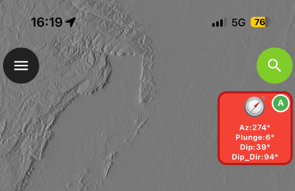

# QField Geological Compass Plugin

A QField plugin for capturing geological orientations (azimuth, pitch, dip, dip direction, strike) using your device's sensors during fieldwork.


   
    
   
## Features

- ✅ **Auto-fill orientation data** when creating new features
- ✅ **Live sensor display** showing real-time values on button
- ✅ **Geological calculations** - automatically calculates dip and dip direction from phone orientation
- ✅ **Toggle modes** - switch between auto and manual with long-press
- ✅ **Works offline** - no internet connection required
- ✅ **Cross-platform** - iOS and Android compatible

## What It Captures

### Phone Orientation (Raw Sensors)
- **Azimuth** (0-360°) - Compass heading from true north (if declination set correctly)
- **Pitch/Plunge** (-90° to +90°) - Forward/backward tilt
- **Roll** (-90° to +90°) - Left/right tilt

### Geological Measurements (Calculated)
- **Dip** (0-90°) - Angle of plane from horizontal
- **Dip Direction** (0-360°) - Azimuth of steepest descent from true north (if declination set correctly)
- **Strike** (0-360°) - Direction perpendicular to dip from true north (if declination set correctly)
- **Azimuth** (0-360°) - Compass heading from true north (if declination set correctly)
- **Plunge** (0-90°) - Plunge of linear feature

All values are saved as **integers** (whole numbers).

## Installation

### 1. Download the Plugin

Download `main.qml` from this repository.


### 2. User-defined parameters 
#### Declination Correction
Open `mail.qml` in a text editor and edit declination value on line 89 so it has your local declination:   


       var localDeclination = -1.5   

#### Magnetic Northern Hemisphere Correction

Open `mail.qml` in a text editor and comment out (add # to start of line) line 91 so it looks like this:   


       # dipDirection = (dipDirection + 180) % 360   


   
### 3. Load the File into QField

**For QFieldCloud projects:**

- Place the `.qml` file in your project folder in QGIS
- Upload it alongside your project using QFieldSync

**For local projects:**
- Rename to same name as project (with `.qml` instead of `.qgs`) and place the `.qml` file in the same directory as your `.qgs` file
- Copy both to your device

**For all QField Projects** 
Upload from zipfile via URL in Qfield App on your device in settings/plugins:
https://github.com/swaxi/compass/archive/refs/heads/main.zip    
   
### 4. Restart QField

Open QField and load your project. Grant permission when prompted.

---

## QGIS Project Setup

### Fields

Add desired fields to your point layer in QGIS:

| Field Name | Type | Description |
|------------|------|-------------|
| `azimuth` | Integer | Compass heading (0-360°) |
| `pitch` or `plunge` | Integer | Forward/backward tilt (-90 to +90°) |
| `dip` | Integer | Dip angle (0-90°) |
| `dip_direction` or `dip_dir` | Integer | Dip direction (0-360°) |
| `strike` | Integer | Strike direction (0-360°) |
| `plunge` | Integer | Lineation plunge (0-90°) |

**Optional fields:**
- `roll` - Side tilt angle

### Recommended Layer Setup

**Option 1: GeoPackage (Recommended)**

```sql
CREATE TABLE orientations (
    fid INTEGER PRIMARY KEY AUTOINCREMENT,
    azimuth INTEGER,
    plunge INTEGER,
    dip INTEGER,
    dip_dir INTEGER,
    plunge INTEGER,
    strike INTEGER,
    
    notes TEXT
);
```

**Option 2: Shapefile**

In QGIS: Layer → New Shapefile Layer
- Geometry: Point
- Add Integer fields: azimuth, plunge, dip, dip_dir, strike, plunge

### Field Configuration in QGIS

1. **Layer Properties → Attributes Form**
2. For each orientation field:
   - Check **Editable** ✓
   - Widget Type: **Text Edit** or **Range**
   - If using Range: Min = 0, Max = 360 (or 90 for dip/plunge)

### QFieldSync Settings

1. Open **QFieldSync** plugin in QGIS
2. **Configure Current Project**
3. Set your orientation layer to: **Offline editing**
4. Package and sync to QField

---

## Usage

### The Button

The plugin adds **one red square button** to QField's toolbar:

```
┌──────────────┐
│       🧭  Ⓐ │  ← Compass icon + Auto indicator (A=auto, M=manual)
│              │
│ Az: 45°      │  ← Live azimuth value
│ Plunge:15°   │  ← Live plunge value
│ Dip:35°      │  ← Live dip angle
│ Dip Dir:135° │  ← Live dip direction
└──────────────┘
```

### Button Action

**Long Press (Hold ~1 second):**
- Toggles between auto and manual mode
- Shows confirmation message

**Button color:**
- 🔴 **Red** = Auto-fill ON (default)
- ⚫ **Gray** = Manual mode

**Indicator:**
- 🟢 **"A"** = Auto-fill ON
- ⚫ **"M"** = Manual mode

   
### Basic Workflow

**With Auto-Fill (Default):**

1. **Position your phone** against the rock surface (with long side of phone parallel to lineation if present)
2. **Tap Green Crosshair** in QField to place point
3. **Form opens** → Fields auto-fill automatically!
4. **Fill other attributes** (notes, rock type, etc.)
5. **Click green checkmark** (✓) to confirm
6. **Save**

**Manual Mode:**

1. Position and orient phone and note values (or use your own compass)
2. Place point and confirm
3. **Form opens** (empty)
4. Fill fields manually 
5. **Save**

---

## Layer Field Mapping

The plugin recognizes these layer field names (case-insensitive):

### Azimuth
- `azimuth`
- `compass`
- `heading`
- `azimut`

### Plunge
- `plunge`
- `plongement`

### Pitch (warning this is the pitch of the device, not of a lineation)
- `pitch`

### Roll (of device)
- `roll`

### Dip
- `dip`
- `dip_angle`
- `pendage`

### Dip Direction
- `dip_direction`
- `dipdirection`
- `dip_dir`

### Strike
- `strike_rhr`
- `strike`


**Note:** You don't need all fields - the plugin will fill whatever fields exist.

---

## How It Works

### Sensor Data Collection

The plugin uses your device's built-in sensors:

1. **Compass** - Provides magnetic azimuth (0-360°)
2. **Accelerometer** - Provides device tilt (X, Y, Z acceleration)

## Troubleshooting

### Fields Don't Auto-Fill

**Check:**
1. Auto-fill is ON (button is red with green "A")
2. Field names match recognized names
3. Field types are Integer or Real (not Text)
4. Layer is editable in QFieldSync

**Solution:**
- Long-press button to ensure auto is ON
- Try manual mode: click button after form opens

### "Cannot Start Editing on Layer" Error

**Causes:**
1. Layer not set to "Offline editing" in QFieldSync
2. Shapefile write permissions issue

**Solutions:**
1. In QGIS: QFieldSync → Configure → Set layer to **Offline editing**
2. Convert to GeoPackage:
   - Right-click layer → Export → Save As
   - Format: GeoPackage
   - Use GeoPackage instead of shapefile

### Values Seem Wrong

**Check calibration:**
- Walk in a figure-8 pattern while holding phone
- This calibrates the compass
- Avoid areas with magnetic interference (metal, power lines)

**Verify orientation:**
- Azimuth should match compass direction
- Dip should increase as surface gets steeper
- Test on flat ground (dip should be near 0°)

### Button Not Visible

1. Restart QField
2. Check plugin file name matches project file
3. Grant plugin permission when prompted

### Button Shows Gray "M" Instead of Red "A"

Long-press the button to toggle auto-fill ON.

---

## Technical Details

### Coordinate Systems

- **Azimuth Reference:** True North if correct declination defined
- **Angle Convention:** Right-hand rule for strike
- **Range:** 0-360° (azimuth, dip_dir, strike), 0-90° (dip), -90 to +90° (pitch/plunge, roll)

### Sensor Update Rate

- Compass: 10 Hz (10 readings/second)
- Accelerometer: 10 Hz
- Display update: 5 Hz (updates every 200ms)

### Accuracy

**Expected accuracy (calibrated device):**
- Azimuth: ±5°
- Pitch/Roll: ±2°
- Dip: ±5°
- Dip Direction: ±5°

**Factors affecting accuracy:**
- Magnetic interference
- Device calibration
- Phone stability during capture
- Sensor quality

---

## Tips for Best Results

### Before Fieldwork

1. ✅ Test plugin in office (after setting correct declination and hemisphere info)
2. ✅ Calibrate compass (figure-8 motion)
3. ✅ Practice measurement technique
4. ✅ Verify data types in QGIS
5. ✅ Sync project to device

### During Fieldwork

1. 📱 Keep phone flat against surface
2. ⏱️ Hold steady for 1-2 seconds
3. 🔍 Check live values look reasonable
4. ✅ Save point measurement

### After Fieldwork

1. 📤 Sync back to QGIS
2. 🔍 Check for outliers
3. 📊 Calculate statistics
4. 🗺️ Visualize orientations
5. 📝 Export for analysis

---


## Compatibility

### QField Versions
- Tested: QField 3.x
- Should work: QField 2.6+

### QGIS Versions
- Tested: QGIS 3.34+
- Should work: QGIS 3.x

### Devices
- ✅ iPhone (iOS 14+)
- ✅ Android phones and tablets
- ⚠️ Requires compass and accelerometer sensors

### Data Formats
- ✅ GeoPackage (.gpkg) - Recommended
- ✅ Shapefile (.shp)
- ✅ PostGIS
- ✅ Any QGIS-supported vector format

---

## FAQ

**Q: Do I need internet connection?**
A: No, works completely offline.

**Q: Does it work on tablets?**
A: Yes, if tablet has compass and accelerometer.

**Q: Can I use it for structural geology?**
A: Yes! Perfect for measuring bedding, foliation, joints, faults, lineations.

**Q: What about true north vs magnetic north?**
A: Plugin uses True north assuming correct declination has been set.

**Q: Can I export data?**
A: Yes, standard QGIS export (CSV, Excel, Shapefile, etc.)

**Q: Does it save photos?**
A: No, but you can add a photo field to your layer separately.

**Q: What if my device doesn't have a compass?**
A: Plugin won't work - compass is required for azimuth.

---

## Support

### Issues

If you encounter problems:
1. Check this README troubleshooting section
2. Verify QGIS project setup
3. Test with manual mode
4. Check QField message logs

### Contributing

Suggestions and improvements welcome!

### License

MIT - see licence info for more details.

---

## Version History

### v1.0 (Current)
- Initial release
- Auto-fill and manual modes
- Live sensor display
- Geological calculations (dip, dip direction, strike, plunge)
- Integer value output
- Cross-platform support

---

## Acknowledgments

Built using:
- QField plugin framework
- Qt Sensors (Compass, Accelerometer)
- QGIS/QField ecosystem
- Claude AI

---

## Quick Reference Card

```
┌─────────────────────────────────────────┐
│  QField Geology Plugin Quick Reference  │
├─────────────────────────────────────────┤
│  BUTTON:                                │
│  🔴 Red + 🟢A = Auto ON                │
│  ⚫ Gray + M = Manual                   │
│                                         │
│  ACTIONS:                               │
│  Hold = Toggle auto/manual              │
│                                         │
│  FIELDS (Integer):                      │
│  azimuth, plunge, dip,                  │
│  dip_dir, strike, plunge, pitch, roll   │
│                                         │
│  WORKFLOW:                              │
│  1. Position phone on surface           │
│  2. Place point (Green crosshair)       │
│  3. Form auto-fills!                    │
│  4. Confirm (green ✓)                   │
│  5. Save                                │
└─────────────────────────────────────────┘
```

---

**Happy geological mapping!**
